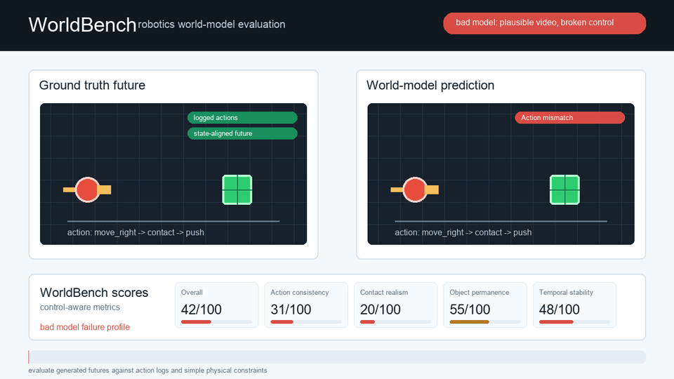

# WorldBench Robotics

Testing and regression infrastructure for robotics world models.

Bring your own robot rollout and predicted futures. WorldBench scores the behaviors it can reliably measure, marks unsupported metrics N/A, compares runs, and saves reproducible evaluation artifacts.

WorldBench is not another world model. It is a local evaluation toolkit for checking whether generated futures are useful for robotics workflows.

<p align="center">
  
</p>

## Badges


## Real Model Evaluation Proof

WorldBench has been run on a real pretrained world model and a real robot rollout:

| Field | Value |
| --- | --- |
| Model | NanoWM B2 RT-1 300K |
| Checkpoint | `knightnemo/nanowm-b2-rt1-300k` |
| Data | RT-1 real robot rollout |
| Scope | 1 rollout |
| Generated future | 8 genuinely generated future frames |

| Metric | Score |
| --- | ---: |
| Overall | 92.4 |
| Visual Similarity | 89.2 |
| Temporal Stability | 96.3 |
| Action Consistency | N/A |
| Object Permanence | N/A |
| Contact Realism | N/A |

This is a single-rollout integration proof, not a standardized leaderboard result and not a claim that NanoWM is 92.4% accurate.

Compact artifact: [artifacts/real_model_eval/nanowm_rt1_episode0.json](artifacts/real_model_eval/nanowm_rt1_episode0.json)

More detail: [docs/real_model_evaluation.md](docs/real_model_evaluation.md)

## Real Checkpoint Regression Proof

WorldBench has also compared two real NanoWM checkpoints from the same model family on the same RT-1 / Fractal episodes:

| Field | Value |
| --- | --- |
| Baseline | `knightnemo/nanowm-b2-rt1-abl-pred-v-50k` |
| Candidate | `knightnemo/nanowm-b2-rt1-300k` |
| Episodes | 10 fixed episodes, IDs 0 through 9 |
| Result | Overall mean improved from 85.67 to 87.28 |
| Episode comparison | 9 improved, 1 regressed, 0 unchanged |
| Gates | Strict PASS; engineering-threshold PASS |

WorldBench detected an overall improvement and also surfaced the one small episode-level regression (`episode_002.mp4`, -0.33). This is a controlled validation slice, not a standardized leaderboard result.

Compact artifacts: [artifacts/checkpoint_validation/](artifacts/checkpoint_validation/)

More detail: [docs/checkpoint_validation.md](docs/checkpoint_validation.md)

## One Quickstart

WorldBench is installed from a source checkout today. This README does not claim a PyPI install path.

```bash
git clone https://github.com/tigee1311/worldbench.git
cd worldbench
python3.11 -m venv .venv
source .venv/bin/activate
python -m pip install --upgrade pip
python -m pip install -e ".[dev,video]"

worldbench --help
worldbench demo
worldbench validate examples/demo_dataset
worldbench eval examples/demo_dataset --predictions examples/demo_dataset/good_model
worldbench report .worldbench/runs/latest/result.json
worldbench dashboard .worldbench/runs/latest/result.json --no-open
```

The demo creates a synthetic rollout plus good and bad prediction folders. It is useful for smoke testing the CLI and reports, but the project is no longer synthetic-only.

## How WorldBench Works

WorldBench evaluates a rollout dataset against predicted future frames.

Input:

- ground-truth robot rollout frames
- predicted future frames
- action logs
- state logs when available
- episode metadata and source provenance

Output:

- per-metric scores
- N/A status and reasons for unsupported metrics
- an overall score computed across available metrics
- per-episode evidence and issues
- JSON artifacts, Markdown reports, comparison artifacts, and a local dashboard

Default metric weights:

| Metric | Weight |
| --- | ---: |
| Visual Similarity | 25 |
| Action Consistency | 30 |
| Temporal Stability | 20 |
| Object Permanence | 15 |
| Contact Realism | 10 |

Overall scores are weighted over available metrics only. In the NanoWM proof, Visual Similarity scored 89.2 with weight 25 and Temporal Stability scored 96.3 with weight 20. Action Consistency, Object Permanence, and Contact Realism were N/A, so WorldBench renormalized over the 45 available weight points:

```text
(89.2 * 25 + 96.3 * 20) / 45 = 92.4 overall
```

## Checkpoint Regression Workflow

WorldBench can now test robotics world-model checkpoints the way pytest tests code: evaluate a fixed suite, compare a baseline checkpoint to a candidate checkpoint, and return a CI-friendly PASS or FAIL.

Directory convention:

```text
eval_suite/
  episode_001.mp4
  episode_002.mp4

checkpoint_183/
  episode_001.mp4
  episode_002.mp4

checkpoint_184/
  episode_001.mp4
  episode_002.mp4
```

Evaluate both checkpoints:

```bash
worldbench eval-batch \
  --ground-truth eval_suite/ \
  --predictions checkpoint_183/ \
  --name checkpoint_183

worldbench eval-batch \
  --ground-truth eval_suite/ \
  --predictions checkpoint_184/ \
  --name checkpoint_184
```

Then gate the candidate:

```bash
worldbench gate \
  --baseline checkpoint_183.json \
  --candidate checkpoint_184.json
```

`eval-batch` pairs videos by relative path, evaluates each episode through the same metric pipeline as `worldbench eval`, saves per-episode results, aggregates available metric scores, and writes per-horizon curves. Unsupported metrics remain N/A and are excluded from numeric aggregates.

`gate` compares overall score, available metric means, per-episode deltas, and per-horizon metric means. The default gate allows no score drop beyond a 0.01-point numerical tolerance; use `--max-overall-drop`, `--max-metric-drop`, and `--max-horizon-drop` to set engineering thresholds for your CI.

For one-off video pairs:

```bash
worldbench eval-video \
  --ground-truth sample_0000_gt.mp4 \
  --prediction sample_0000_gen.mp4 \
  --skip-context 4
```

`eval-video` removes the context frames from both videos and scores only the aligned future frames. It rejects mismatched future lengths, incompatible resolution, incompatible FPS, unreadable videos, and empty videos rather than silently truncating or resampling.

More detail: [docs/checkpoint_regression.md](docs/checkpoint_regression.md)

## Real Data Validation

WorldBench has an opt-in integration test against a public LeRobot Yaskawa cable-untangling dataset:

| Check | Value |
| --- | ---: |
| Video timeline | 900 frames |
| Control timeline | 4,952 rows |
| Actions | 7D |
| States | 7D |
| Source video | 640x480 RGB |

The normal test suite does not download this dataset. The integration test is marked separately because it depends on Hugging Face data access.

Detailed methodology: [docs/real_data_validation.md](docs/real_data_validation.md)

## Metric Availability And N/A Behavior

WorldBench does not invent scores.

A metric returns N/A when the rollout does not provide the semantics required for reliable evaluation. Unsupported metrics are excluded from the overall score, and the remaining metric weights are renormalized.

| Metric | Available when | Returns N/A when | Notes |
| --- | --- | --- | --- |
| Visual Similarity | Ground-truth and predicted image pairs can be aligned. | It currently returns 0 with an issue if no image pairs are available. | Uses MSE, PSNR, and SSIM-style structure. Falls back to a NumPy SSIM approximation if `scikit-image` is absent. |
| Temporal Stability | At least two predicted frames are available. | It currently returns 0 with an issue if fewer than two predicted frames are available. | Measures frame-to-frame deltas, jumps, flicker, and variance. |
| Action Consistency | Actions are string commands such as `move_right`, or records provide explicit `dx` and `dy`. | Raw arbitrary numeric action vectors are present without an action adapter. | This prevents 7D robot actions from being misread as zero-motion commands. |
| Object Permanence | The rollout is explicitly synthetic and supports the current color/blob tracking heuristic. | Real rollouts or other data without reliable object tracking are used. | Real-world object permanence needs reliable tracking support before scoring. |
| Contact Realism | The rollout is explicitly synthetic and supports robot/object tracking. | Real rollouts or other data without reliable robot and object tracking are used. | Real-world contact realism needs reliable tracking support before scoring. |

Full details: [docs/metric_support.md](docs/metric_support.md)

## Native LeRobot Import

WorldBench supports native Hugging Face LeRobot datasets through the optional `lerobot` extra. LeRobot is not a mandatory base dependency.

```bash
python -m pip install -e ".[lerobot,video]"
worldbench import-lerobot \
  --repo-id chocolat-nya/yaskawa-untangle-dataset \
  --episodes 0:1 \
  --camera observation.images.fixed_cam1 \
  --timeline video \
  --out examples/yaskawa_video
```

Implemented behavior:

- `--timeline video` is the default and exports one WorldBench timestep per unique source camera frame.
- `--timeline control` exports one WorldBench timestep per source control row and may repeat camera frames when control runs faster than video.
- Video timeline action alignment uses the latest control action at or before the video timestamp.
- Video timeline state alignment uses the nearest source state timestamp.
- Control timeline action and state alignment use the source control row.
- Exported actions and states include source provenance fields when available: source control index/timestamp and source video frame index/timestamp.
- Episode metadata records source repo id, episode index, camera key, timeline, FPS, alignment strategy, source control steps, source video frame counts, and exported timestep counts.
- The legacy local LeRobot-style folder converter remains available through `worldbench import-lerobot <input_path> --out <output_path>` and `worldbench import-lerobot --demo --out <output_path>`.

CLI help confirms the current flags:

```bash
worldbench import-lerobot --help
```

## Corruption Validation

WorldBench includes compact corruption benchmark artifacts for real Yaskawa video-timeline data. These are reproducible JSON summaries, not generated video or frame directories.

Frame-freeze benchmark: [artifacts/frame_freeze_benchmark.json](artifacts/frame_freeze_benchmark.json)

| Severity | Overall | Temporal |
| ---: | ---: | ---: |
| 0% | 99.68 | 99.28 |
| 5% | 99.40 | 98.66 |
| 15% | 99.09 | 97.97 |
| 30% | 98.81 | 97.36 |

Temporal-scramble benchmark: [artifacts/temporal_scramble_benchmark.json](artifacts/temporal_scramble_benchmark.json)

| Severity | Overall | Temporal |
| ---: | ---: | ---: |
| 0% | 99.68 | 99.28 |
| 5% | 99.64 | 99.19 |
| 15% | 99.58 | 99.07 |
| 30% | 99.51 | 98.96 |

The temporal-scramble response is currently weaker than the frame-freeze response.

## CLI

Current commands:

```text
worldbench benchmark         Run WorldBench benchmark scenarios.
worldbench compare           Compare result files or two model folders inside a dataset.
worldbench dashboard         Launch a local WorldBench dashboard.
worldbench demo              Generate a complete synthetic demo dataset and good/bad model outputs.
worldbench eval              Run all WorldBench metrics and save result.json.
worldbench eval-batch        Evaluate one checkpoint across a directory of episode videos.
worldbench eval-video        Evaluate one predicted future video against one ground-truth video.
worldbench gate              Return PASS or FAIL for a candidate checkpoint regression gate.
worldbench import-lerobot    Import LeRobot data into WorldBench format.
worldbench init              Create a sample WorldBench dataset folder structure.
worldbench make-demo-video   Generate README demo MP4, GIF, and thumbnail assets.
worldbench make-screenshots  Generate README dashboard and report screenshot assets.
worldbench report            Generate a Markdown report from a result JSON file.
worldbench validate          Validate a WorldBench dataset.
```

Common command shapes:

```bash
worldbench init <path>
worldbench demo [output]
worldbench validate <dataset_path>
worldbench eval <dataset_path> --predictions <predictions_path>
worldbench eval-video --ground-truth <gt.mp4> --prediction <pred.mp4> --skip-context 4
worldbench eval-batch --ground-truth <eval_suite> --predictions <checkpoint_dir> --name checkpoint_184
worldbench gate --baseline checkpoint_183.json --candidate checkpoint_184.json
worldbench compare <dataset_path> --models good_model bad_model
worldbench compare <run_a/result.json> <run_b/result.json>
worldbench benchmark --demo
worldbench benchmark <benchmark_path>
worldbench import-lerobot --repo-id <user/dataset> --episodes 0:1 --camera <camera_key> --timeline video --out <output_path>
worldbench report <result_json> --output <report.md>
worldbench dashboard <result_json_or_dataset_path> --host 127.0.0.1 --port 8765 --no-open
```

`worldbench eval` writes timestamped results under `.worldbench/runs/` and updates `.worldbench/runs/latest/result.json`.

## Python SDK

```python
from worldbench import WorldBench

bench = WorldBench("examples/demo_dataset")
result = bench.evaluate(predictions="examples/demo_dataset/good_model")
print(result.score)
result.save_json("result.json")
result.save_report("report.md")
```

Composable metrics:

```python
from worldbench import Metrics, WorldBench

bench = WorldBench("examples/demo_dataset")
result = bench.run(
    metrics=[
        Metrics.visual_similarity(),
        Metrics.temporal_stability(),
        Metrics.action_consistency(),
    ],
    predictions="examples/demo_dataset/good_model",
)
```

## Dataset Format

WorldBench datasets are episode folders with frames, optional in-episode predictions, action records, state records, and metadata.

```text
dataset/
  episode_001/
    frames/
      000001.png
      000002.png
    predictions/
      000001.png
      000002.png
    actions.json
    states.json
    metadata.json
```

`actions.json` is a list of action records. Current fields include:

```json
{
  "t": 0,
  "timestamp": 0.0,
  "source_control_index": 12,
  "source_control_timestamp": 0.4,
  "source_video_frame_index": 12,
  "source_video_timestamp": 0.4,
  "action": "move_right",
  "dx": 1.0,
  "dy": 0.0,
  "gripper": "open"
}
```

`states.json` is a list of state records. Current fields include:

```json
{
  "t": 0,
  "timestamp": 0.0,
  "source_control_index": 12,
  "source_control_timestamp": 0.4,
  "source_video_frame_index": 12,
  "source_video_timestamp": 0.4,
  "observation_state": [0.0, 0.1],
  "robot_x": 20,
  "robot_y": 50,
  "object_x": 80,
  "object_y": 50
}
```

`metadata.json` records episode-level information such as `name`, `robot`, `task`, `fps`, `description`, and LeRobot provenance fields when imported from LeRobot.

The result schema is represented by `EvaluationResult`:

- `dataset_path`
- `predictions_path`
- `created_at`
- `score`
- `metrics`
- `episodes`
- `horizon`
- `provenance`
- `weights`
- `issues`
- `main_failure`

Each metric result contains `name`, `score`, `status`, `reason`, `details`, and `issues`.

## Current Limitations

- The NanoWM proof is one real-model rollout so far.
- The NanoWM proof evaluates eight generated future frames.
- The NanoWM score is not a standardized leaderboard result.
- Arbitrary numeric action vectors require explicit action adapters before action consistency can be scored.
- Real-world object permanence requires reliable object tracking support.
- Real-world contact realism requires reliable robot and object tracking support.
- Temporal scrambling currently produces a weaker score response than frame freezing.
- Normal CI does not download large LeRobot datasets or rerun expensive model inference.

## Roadmap

Working now:

- synthetic demo
- external prediction evaluation
- native LeRobot import
- video/control timelines
- real robot rollout evaluation
- model comparison
- unavailable-metric handling
- corruption validation
- real NanoWM evaluation
- direct video-pair evaluation
- multi-episode checkpoint aggregation
- per-horizon curves
- regression gate
- reports
- dashboard

Next:

- explicit action-adapter registry
- second real world model
- external users

Later:

- ManiSkill/RLBench
- ROS bags
- shared run reports
- standardized leaderboard

Full roadmap: [docs/ROADMAP.md](docs/ROADMAP.md)

## Contributing

WorldBench is intentionally small and inspectable. Useful contributions include:

- action adapters for real robot action spaces
- tracking adapters for real-world object/contact metrics
- additional compact real-model artifacts
- offline tests for importer and metric edge cases
- report and dashboard polish

Before opening a PR:

```bash
python -m pip install -e ".[dev]"
ruff check .
pytest
```

Keep large generated media, extracted frame folders, temporary datasets, and model prediction directories out of commits.

## License

Apache-2.0. See [LICENSE](LICENSE).
