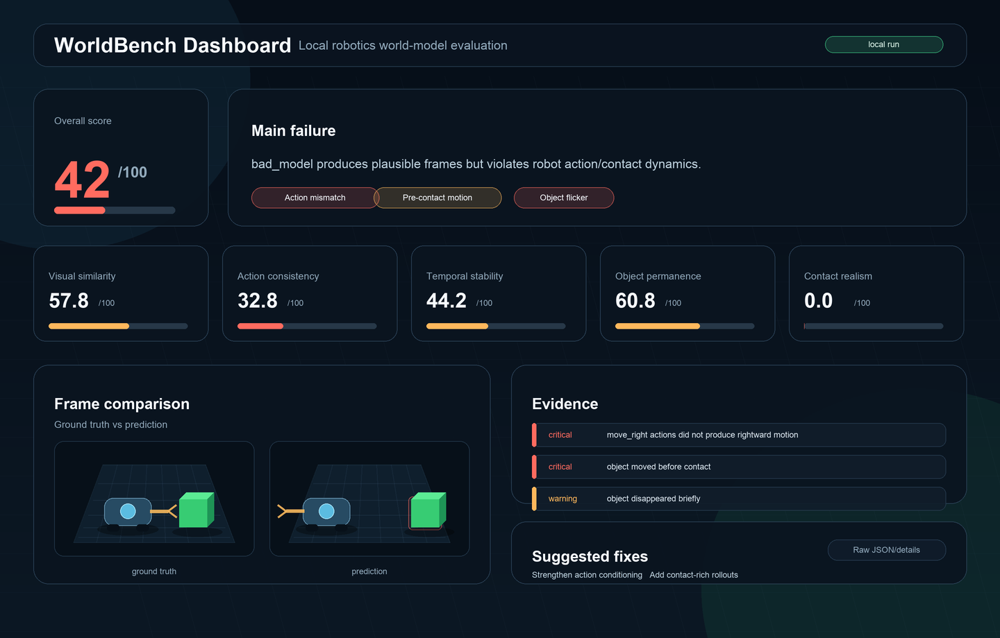
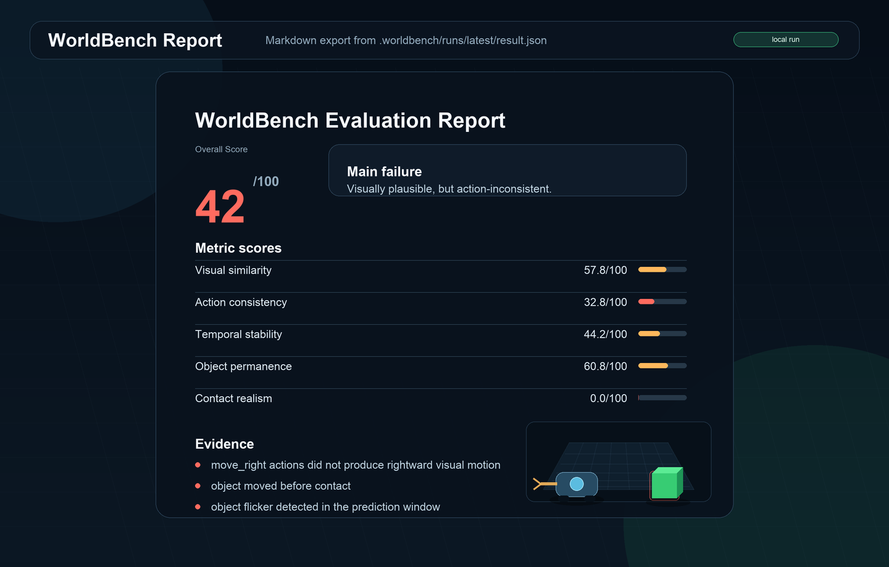

# WorldBench


### Evaluate robotics world models with one command.

WorldBench catches when a robot world model looks right but is actually wrong: it checks whether generated futures follow robot actions, contact physics, temporal consistency, and object permanence.

<p align="center">
  
</p>

```bash
git clone https://github.com/tigee1311/worldbench.git
cd worldbench
python3 --version
python3 -m venv .venv
source .venv/bin/activate
python -m pip install --upgrade pip
python -m pip install -e ".[dev,video]"
worldbench --help
worldbench demo
worldbench eval examples/demo_dataset --predictions examples/demo_dataset/bad_model
worldbench compare examples/demo_dataset --models good_model bad_model
worldbench benchmark --demo
worldbench dashboard .worldbench/runs/latest/result.json
```

```text
WorldBench Report
Overall Score: 42/100
Action Consistency: 31/100
Contact Realism: 20/100
Object Permanence: 55/100

Main failure:
The model generates plausible frames but ignores the robot action sequence.
```

**Not another world model. The test suite for world models.**

Features • Quickstart • CLI • Python SDK • Metrics • Roadmap

## Quickstart

```bash
git clone https://github.com/tigee1311/worldbench.git
cd worldbench

python3 --version
python3 -m venv .venv
source .venv/bin/activate

python -m pip install --upgrade pip
python -m pip install -e ".[dev,video]"

worldbench --help

worldbench demo
worldbench validate examples/demo_dataset
worldbench eval examples/demo_dataset --predictions examples/demo_dataset/good_model
worldbench eval examples/demo_dataset --predictions examples/demo_dataset/bad_model
worldbench compare examples/demo_dataset --models good_model bad_model
worldbench benchmark --demo
worldbench report .worldbench/runs/latest/result.json
worldbench dashboard .worldbench/runs/latest/result.json
```

`worldbench eval` writes timestamped runs under `.worldbench/runs/` and also updates `.worldbench/runs/latest/result.json` for quick iteration.

WorldBench requires Python 3.10+. If your system `python3` is Python 3.9 or lower, install Python 3.11 and create the virtual environment with `python3.11 -m venv .venv`.

Use `python -m pip` instead of `pip` so the package installs into the active virtual environment. This avoids `pip: command not found` and prevents installing into the wrong Python.

## What It Does

WorldBench is a Python SDK, CLI, and local dashboard for robotics AI teams building or evaluating world models. It takes a robot rollout dataset plus predicted future frames and produces:

- Control-aware metric scores
- Per-episode failure evidence
- Benchmark-style model comparisons
- Synthetic benchmark scenario results
- Markdown reports
- A zero-dependency local HTML dashboard
- An experimental LeRobot-style local folder import
- A synthetic demo that works without robots, GPUs, or model training

## Input and Output

Input:

- robot rollout frames
- action logs
- state data
- predicted future frames

Output:

- control-aware scores
- failure evidence
- Markdown reports
- local dashboard
- model comparison results

## Why WorldBench?

Robotics world models can make futures that look realistic while still being wrong for control. A prediction is not useful if it moves opposite the commanded action, teleports a cube before contact, drops a task object, or flickers across the rollout.

WorldBench focuses on the failure modes that matter when a robot planner consumes generated futures. It is for world-model builders, robotics ML researchers, and evaluation engineers who need more than a pretty-video metric before trusting predictions in planning loops.

## Why Not Just SSIM/PSNR?

Traditional video metrics can say a prediction is good even when it is useless for robotics.

A world model can score high visually while:

- moving the robot opposite the commanded action
- teleporting objects before contact
- dropping task-relevant objects
- flickering across frames
- breaking state/action alignment

WorldBench adds control-aware metrics for robotics world models.

## Installation

WorldBench is currently installed from a source checkout:

```bash
git clone https://github.com/tigee1311/worldbench.git
cd worldbench
python3 --version
python3 -m venv .venv
source .venv/bin/activate
python -m pip install --upgrade pip
python -m pip install -e ".[dev,video]"
worldbench --help
```

Future PyPI releases may support:

```bash
python -m pip install worldbench
```

WorldBench is not assumed to be published on PyPI yet. If the `worldbench` package name is unavailable on PyPI, the package may ship as `worldbench-ai`.

For tests and local development:

```bash
python -m pip install -e ".[dev]"
python -m pytest
```

`scikit-image` is optional for SSIM:

```bash
python -m pip install -e ".[vision]"
```

If `scikit-image` is not installed, WorldBench uses a lightweight NumPy fallback.

### macOS Setup

If `python3 --version` shows Python 3.9 or older, install Python 3.11:

```bash
brew install python@3.11
```

Then recreate the virtual environment:

```bash
rm -rf .venv
python3.11 -m venv .venv
source .venv/bin/activate
python -m pip install --upgrade pip
python -m pip install -e ".[dev,video]"
worldbench --help
```

If Homebrew is unavailable, install Python 3.11 from [python.org](https://www.python.org/downloads/), then create the virtual environment with that Python.

### Environment Check

Run these from the repository root after activating `.venv`:

```bash
python --version
which python
python -m pip --version
worldbench --help
```

If Python is below 3.10, recreate the virtual environment with Python 3.11.

### Troubleshooting

`zsh: command not found: pip`

Use:

```bash
python3 -m pip --version
python3 -m pip install --upgrade pip
```

Inside the virtual environment, use:

```bash
python -m pip install -e ".[dev,video]"
```

`zsh: command not found: worldbench`

This means WorldBench was not installed into your active environment. Run:

```bash
source .venv/bin/activate
python -m pip install -e ".[dev,video]"
worldbench --help
```

`requires a different Python: 3.9.6 not in >=3.10`

Install Python 3.11, then recreate the virtual environment:

```bash
brew install python@3.11
rm -rf .venv
python3.11 -m venv .venv
source .venv/bin/activate
python -m pip install -e ".[dev,video]"
```

`does not appear to be a Python project: neither setup.py nor pyproject.toml found`

You are in the wrong folder. Go to the repo root, where `pyproject.toml` exists:

```bash
cd ~/worldbench
ls
```

You should see:

```text
README.md
pyproject.toml
worldbench/
examples/
scripts/
```

Then install again:

```bash
python -m pip install -e ".[dev,video]"
```

## Live Demo Flow

Use these commands after installation:

```bash
worldbench demo
worldbench validate examples/demo_dataset
worldbench eval examples/demo_dataset --predictions examples/demo_dataset/bad_model
worldbench eval examples/demo_dataset --predictions examples/demo_dataset/good_model
worldbench compare examples/demo_dataset --models good_model bad_model
worldbench report .worldbench/runs/latest/result.json
worldbench dashboard .worldbench/runs/latest/result.json
```

What each command does:

- `worldbench demo` creates a synthetic rollout with good and bad predictions.
- `worldbench validate examples/demo_dataset` checks that frames, actions, states, and metadata exist.
- `worldbench eval ... bad_model` scores the bad prediction.
- `worldbench eval ... good_model` scores the good prediction.
- `worldbench compare ...` shows why the good model is more reliable.
- `worldbench report ...` writes a Markdown report for the latest run.
- `worldbench dashboard ...` opens a local debugging view.

## CLI Usage

```bash
worldbench init <path>
worldbench demo
worldbench validate <dataset_path>
worldbench eval <dataset_path> --predictions <predictions_path>
worldbench compare <dataset_path> --models good_model bad_model
worldbench compare <run_a/result.json> <run_b/result.json>
worldbench benchmark --demo
worldbench benchmark benchmarks/
worldbench import-lerobot <input_path> --out <output_path>
worldbench import-lerobot --repo-id <user/dataset> --episodes 0:1 --camera <camera_key> --timeline video --out <output_path>
worldbench import-lerobot --demo --out examples/lerobot_push_cube
worldbench report <result_json>
worldbench dashboard <result_json_or_dataset_path>
```

Example:

```bash
worldbench demo
worldbench eval examples/demo_dataset --predictions examples/demo_dataset/bad_model
worldbench compare examples/demo_dataset --models good_model bad_model
worldbench benchmark --demo
worldbench report .worldbench/runs/latest/result.json
worldbench dashboard .worldbench/runs/latest/result.json
```

`worldbench compare examples/demo_dataset --models good_model bad_model` evaluates both model folders, prints the largest metric gaps, and writes `.worldbench/comparisons/latest/comparison.json` plus `.worldbench/comparisons/latest/comparison.md`.

## Python SDK Usage

```python
from worldbench import WorldBench, WorldModelRun

bench = WorldBench(dataset="examples/demo_dataset")
result = bench.evaluate(predictions="examples/demo_dataset/good_model")
result.print_summary()
result.save_report("report.md")
```

Convenience API:

```python
from worldbench import evaluate, load_dataset

dataset = load_dataset("examples/demo_dataset")
result = evaluate(dataset)
print(result.score)
```

Composable metrics:

```python
from worldbench import Metrics, WorldBench

bench = WorldBench("examples/demo_dataset")
result = bench.run(
    metrics=[
        Metrics.visual_similarity(),
        Metrics.action_consistency(),
        Metrics.temporal_stability(),
    ],
    predictions="examples/demo_dataset/good_model",
)
```

## Dataset Format

```text
dataset/
  episode_001/
    frames/
      000.png
      001.png
      002.png
    predictions/
      000.png
      001.png
      002.png
    actions.json
    states.json
    metadata.json
```

`actions.json`:

```json
[
  {"t": 0, "action": "move_right", "dx": 1.0, "dy": 0.0, "gripper": "open"},
  {"t": 1, "action": "move_right", "dx": 1.0, "dy": 0.0, "gripper": "open"},
  {"t": 2, "action": "close_gripper", "dx": 0.0, "dy": 0.0, "gripper": "closed"}
]
```

`states.json`:

```json
[
  {"t": 0, "robot_x": 20, "robot_y": 50, "object_x": 80, "object_y": 50},
  {"t": 1, "robot_x": 30, "robot_y": 50, "object_x": 80, "object_y": 50},
  {"t": 2, "robot_x": 40, "robot_y": 50, "object_x": 80, "object_y": 50}
]
```

`metadata.json`:

```json
{
  "name": "push_cube_demo",
  "robot": "synthetic_2d_arm",
  "task": "push cube",
  "fps": 5,
  "description": "Synthetic robot rollout for world-model evaluation"
}
```

Prediction folders can be dataset-native:

```text
episode_001/predictions/000.png
```

or model-run style:

```text
predictions/episode_001/000.png
```

## Experimental Adapters

### LeRobot Import

WorldBench can import selected episodes from native LeRobot datasets on Hugging Face:

```bash
worldbench import-lerobot \
  --repo-id chocolat-nya/yaskawa-untangle-dataset \
  --episodes 0:1 \
  --camera observation.images.fixed_cam1 \
  --timeline video \
  --out ./robot_data
```

`--timeline video` is the default and exports one WorldBench timestep per unique camera frame. `--timeline control` exports one timestep per source robot control row, which may repeat camera frames when control runs faster than video.

WorldBench also keeps the legacy experimental LeRobot-style local folder converter for folders shaped like `images/`, `actions.json`, `states.json`, and `metadata.json`.

```bash
worldbench import-lerobot --demo --out examples/lerobot_push_cube
worldbench validate examples/lerobot_push_cube
```

Input:

```text
input_path/
  images/
    000.png
    001.png
    002.png
  actions.json
  states.json
  metadata.json
```

Output:

```text
output_path/
  episode_001/
    frames/
      000.png
      001.png
      002.png
    actions.json
    states.json
    metadata.json
```

## Benchmarks

WorldBench includes a lightweight synthetic benchmark suite for common robotics world-model failure modes:

- action mismatch
- pre-contact object motion
- object disappearance
- temporal flicker
- push-cube interaction dynamics

```bash
worldbench benchmark --demo
```

`worldbench benchmark --demo` writes `.worldbench/benchmarks/latest/benchmark.json` and `.worldbench/benchmarks/latest/benchmark.md`.

## Metrics

| Metric | Weight | What it checks |
|---|---:|---|
| Visual similarity | 25% | MSE, PSNR, and SSIM-style structure against ground-truth frames. |
| Action consistency | 30% | Whether visual robot motion follows action logs such as `move_right` or `move_left`. |
| Temporal stability | 20% | Flicker, sudden jumps, and unstable frame-to-frame deltas. |
| Object permanence | 15% | Whether the main task object remains visible and stable. |
| Contact realism | 10% | Whether object motion starts before plausible robot/object contact. |

The default overall score is a weighted average across these metrics.

## Example Outputs

### Example Benchmark

| Model | Overall | Action consistency | Contact realism | Object permanence |
|---|---:|---:|---:|---:|
| good_model | 88 | 91 | 84 | 95 |
| bad_model | 42 | 31 | 20 | 55 |

This toy benchmark is generated by `worldbench demo`, but it shows the type of failure WorldBench is designed to catch: realistic-looking predictions that do not follow robot actions or contact physics.

Sample reports:

- [good_model_report.md](examples/sample_reports/good_model_report.md)
- [bad_model_report.md](examples/sample_reports/bad_model_report.md)

### Screenshots

<p align="center">
  
</p>

<p align="center">
  
</p>

## Supported Now Vs Roadmap

| Feature | Status |
|---|---|
| Synthetic demo dataset | Supported |
| Good vs bad model comparison | Supported |
| CLI evaluation | Supported |
| Markdown reports | Supported |
| Local dashboard | Supported |
| Action consistency scoring | Supported |
| Object permanence scoring | Supported |
| Contact realism scoring | Supported |
| Model comparison command | Supported |
| Experimental LeRobot-style import | Experimental |
| ROS bag import | Planned |
| ManiSkill/RLBench adapters | Planned |
| Real robot rollout support | Planned |
| Cloud run sharing | Planned |
| Benchmark leaderboard | Planned |

## Scaling Path

WorldBench starts with synthetic rollouts so failure modes are easy to see. The next steps are experimental LeRobot-style import improvements, ROS bag import, ManiSkill/RLBench adapters, real robot rollout examples, and benchmark leaderboards.

## Release and Publishing

Release materials live in:

- [release_checklist.md](docs/release_checklist.md)
- [release_notes_v0.1.0.md](docs/release_notes_v0.1.0.md)
- [publishing.md](docs/publishing.md)
- [demo_video_guide.md](docs/demo_video_guide.md)

The publishing notes include TestPyPI and PyPI commands for maintainers. WorldBench does not require cloud services to run locally.

## Name Note

WorldBench is currently an open-source robotics world-model evaluation toolkit in this repository. The name may overlap with research benchmarks using the same name, and the project may be renamed later if needed.

## Contributing

WorldBench is intentionally small and easy to inspect. Useful contributions include:

- New control-aware metrics
- Dataset import adapters
- Better synthetic rollout scenarios
- Dashboard/report polish
- Tests for metric edge cases

Before opening a PR:

```bash
python -m pip install -e ".[dev]"
python -m pytest
```

## License

Apache-2.0. See [LICENSE](LICENSE).
