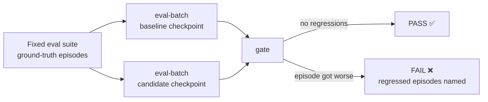
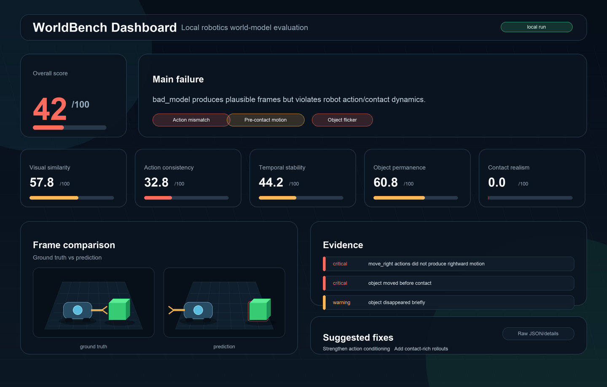

<div align="center">

# WorldBench

**CI-grade regression testing for robotics world models.**

*Did the new checkpoint actually improve — and what got worse?*

[](https://github.com/tigee1311/worldbench/actions/workflows/tests.yml)
[](https://pypi.org/project/worldbench/)


*A real run: WorldBench gates a NanoWM checkpoint upgrade — and catches the one episode that got worse.*

</div>

---

Every world-model training run ends the same way: the aggregate metric went up, someone eyeballs a few rollouts, and the checkpoint ships. Nobody knows which episodes silently got worse.

WorldBench is the missing regression gate. It evaluates baseline and candidate prediction videos on the **same fixed episode suite**, computes per-episode and per-horizon deltas, and returns a reproducible, CI-friendly **PASS or FAIL** — with the regressed episodes named, not averaged away.

```text
same fixed episodes
  -> baseline predictions vs candidate predictions
  -> per-episode and per-horizon deltas
  -> reproducible PASS or FAIL gate
```

Teams training video world models — the substrate behind modern robot learning — have nothing like `pytest` for checkpoints today. WorldBench is that layer: local-first, provenance-hashed, and strict enough that you cannot accidentally compare against the wrong eval suite.

## Try it in 60 seconds

```bash
python -m pip install "worldbench[video]"
worldbench eval-videos --demo --output results/demo
```

Have a real ground-truth future and a predicted future?

```bash
worldbench eval-videos \
  --ground-truth ground_truth.mp4 \
  --prediction predicted_future.mp4 \
  --output results/
```

You get `result.json` (machine-readable, hash-verified), `summary.md`, and a side-by-side `comparison.png`. `eval-videos` is single-prediction evaluation — the real product is the gate below.

## The checkpoint gate


```mermaid
flowchart LR
    A[Fixed eval suite<br/>ground-truth episodes] --> B[eval-batch<br/>baseline checkpoint]
    A --> C[eval-batch<br/>candidate checkpoint]
    B --> D[gate]
    C --> D
    D -->|no regressions| E[PASS ✅]
    D -->|episode got worse| F[FAIL ❌<br/>regressed episodes named]
```

```bash
worldbench eval-batch --ground-truth eval_suite --predictions baseline_predictions \
  --name baseline --skip-context 4 --output baseline.json

worldbench eval-batch --ground-truth eval_suite --predictions candidate_predictions \
  --name candidate --skip-context 4 --output candidate.json

worldbench gate --baseline baseline.json --candidate candidate.json \
  --strict-config-match --max-episode-regressions 0
```

The gate hard-fails — it doesn't just warn — if episode suites differ, dataset hashes mismatch, metric configurations drift, or coverage silently drops. Optional paired-bootstrap confidence bounds (`--bootstrap-samples`) add statistical rigor without breaking existing gates. Every result is re-verifiable later with `worldbench verify-run result.json`.

### Gate checkpoints in CI

```yaml
- uses: tigee1311/worldbench@main
  with:
    ground-truth: eval_suite
    predictions: candidate_predictions
    baseline: artifacts/worldbench/approved-baseline.json
    config: worldbench.yml
```

One step in any GitHub workflow: install, evaluate, gate, fail the PR on regression. Details in [docs/CI_INTEGRATION.md](docs/CI_INTEGRATION.md).

## Proof on a real model

The flagship committed proof compares two public NanoWM-B/2 checkpoints on the same fixed 10-episode RT-1 / Fractal suite (Tesla T4, pinned checkpoint SHAs, per-episode seeds):

| | |
| --- | --- |
| Baseline → candidate | `nanowm-b2-rt1-abl-pred-v-50k` → `nanowm-b2-rt1-300k` |
| Composite Score | 85.67 → 87.28 (**+1.61**) |
| Episodes improved / regressed | **9 / 1** |
| Regression surfaced | `episode_002.mp4` (−0.33) — not hidden in the aggregate |
| Gate result | strict PASS, engineering-threshold PASS |

This is a fixed-suite validation proof, not a public model ranking. Full artifacts with provenance hashes: [artifacts/checkpoint_validation/](artifacts/checkpoint_validation/) · method: [docs/checkpoint_validation.md](docs/checkpoint_validation.md)

## Diagnosis, not just a number

<div align="center">

</div>

WorldBench scores five metrics and tells you exactly which are live for your data:

| Metric | Weight | Availability |
| --- | --- | --- |
| Visual Similarity (MSE + PSNR + SSIM) | 25% | Any aligned RGB video pair |
| Temporal Stability (flicker, jumps) | 20% | Any predicted video (≥2 frames) |
| Action Consistency | 30% | Requires action labels or an action adapter |
| Object Permanence | 15% | Requires object tracking (synthetic suites today) |
| Contact Realism | 10% | Requires robot+object tracking (synthetic suites today) |

Metrics without their required signals report **N/A — never a fake zero** — and the composite renormalizes over what's actually available, with coverage reported in every result. Availability rules per metric: [docs/METRIC_CARDS.md](docs/METRIC_CARDS.md)

## What it works with

**Directly:** aligned predicted-future RGB frames or videos · action-conditioned robot video predictors · image-to-video robot models · latent models with deterministic RGB decoders · simulator-rendered futures. **Via adapter:** robot-specific action vectors, custom dataset layouts, latent/state outputs, 3D/point-cloud renders — see the [extension API](docs/EXTENDING_WORLDBENCH.md) and the [compatibility matrix](docs/COMPATIBILITY_MATRIX.md). **Importers:** [LeRobot](docs/LEROBOT.md) datasets, [NanoWM RT-1](docs/NANOWM_RT1.md).

## Documentation

| | |
| --- | --- |
| [CLI reference](docs/CLI.md) · [Python API](docs/PYTHON_API.md) | All 11 commands, programmatic use |
| [Saved-video evaluation](docs/SAVED_VIDEO_EVALUATION.md) | The beginner path |
| [Checkpoint regression](docs/checkpoint_regression.md) · [CI integration](docs/CI_INTEGRATION.md) | The production path |
| [Metric cards](docs/METRIC_CARDS.md) · [Extending WorldBench](docs/EXTENDING_WORLDBENCH.md) | What's measured, how to add your own |
| [Roadmap](docs/ROADMAP.md) · [External pilot protocol](docs/EXTERNAL_PILOT.md) | Where this goes next |

## Roadmap

Working now: batch evaluation, regression gates, bootstrap uncertainty, provenance verification, LeRobot import, plugin metrics/adapters. Near-term: adapters for common export layouts, a second public-model validation, external pilots with teams already producing saved predictions. Deliberately deferred until validated: leaderboards, learned metrics, real-robot execution. The [roadmap](docs/ROADMAP.md) separates verified behavior from future work — nothing unimplemented is marked done.

## Scope and honest limits

WorldBench evaluates **saved predicted visual futures**. It does not run robot control, execute real-world tasks, or claim a video metric predicts real-robot task success. The two robotics-semantic metrics (Object Permanence, Contact Realism) currently activate on synthetic tracking suites; on arbitrary real video the gate runs on Visual Similarity and Temporal Stability with coverage explicitly reported. External adoption and human calibration are documented as [protocols](docs/EXTERNAL_PILOT.md), not claimed as done.

## Contributing

Issues and pilot requests welcome — especially if your team already produces saved world-model predictions. Start with [CONTRIBUTING.md](CONTRIBUTING.md), or open an [integration request](https://github.com/tigee1311/worldbench/issues/new/choose).

Apache-2.0 · [Changelog](CHANGELOG.md) · [worldbench.xyz](https://worldbench.xyz)
